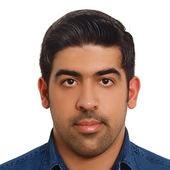

  

I am a last-year Ph.D. student at the University of Basel and a visiting researcher at University College London (UCL). I am working under the supervision of [Prof. Ivan Dokmanić](https://sada.dmi.unibas.ch/en/people/head-of-sada/ivan-dokmanic) and [Prof. Jason McEwen](http://www.jasonmcewen.org/). Before my Ph.D., I was a master student at Sharif University of Technology.

 &nbsp;&nbsp;&nbsp;  &nbsp;&nbsp;&nbsp; 
&nbsp;&nbsp;&nbsp; 

  

## News

* **Jan 2024**: Our recent preprint is now available on ArXiv.
* **Nov 2023**: Our paper "Conditional Injective Flows for Bayesian Imaging" is among the top 25 most downloaded papers in IEEE Transactions on Computational Imaging (TCI) from Sept. 2022 - Sept. 2023.
* **Aug 2023**: Our paper "Deep Injective Prior for Inverse Scattering" has been accepted by IEEE Transactions on Antennas and Propagation.
* **July 2023**: I am awarded a grant by the Promotion of Young Talent at the University of Basel to spend 9 months as a visiting scholar at University College London (UCL), focused on leveraging deep generative models for astrophysics in Prof. Jason McEwen's group. 
* **Feb 2023**: Our paper "Conditional Injective Flows for Bayesian Imaging" has been accepted by IEEE Transactions on Computational Imaging.
* **Jan 2023**: Our paper "FunkNN: Neural Interpolation for Functional Generation" has been accepted by ICLR 2023.
* **Dec 2022**: Our paper has been accepted by European Conference on Antennas and Propagation (EUCAP 2023).
* **Jun 2021**: Our paper has been accepted by the Conference on Uncertainty in Artificial Intelligence (UAI 2021).
* **April 2020**: I started my Ph.D. at the SADA group, University of Basel.

 

## Research
My research lies at the intersection of deep learning and computational imaging. I am interested in building deep learning architectures for solving scientific inverse problems. My main focus is on generative models, and neural fields and representation learning. 

  

  

**Deep Injective Prior for Inverse Scattering**  
AmirEhsan Khorashadizadeh, Vahid Khorashadizadeh, Sepehr Eskandari, Guy A.E. Vandenbosch and Ivan Dokmanić  
**IEEE Transactions on Antennas and Propagation 2023**    
 &nbsp;&nbsp;&nbsp; 
&nbsp;&nbsp;&nbsp; 

  

  
     

**FunkNN: Neural Interpolation for Functional Generation**  
AmirEhsan Khorashadizadeh, Anadi Chaman, Valentin Debarnot and Ivan Dokmanić  
**ICLR 2023**    
 &nbsp;&nbsp;&nbsp; 
&nbsp;&nbsp;&nbsp; 

  

  

**Conditional Injective Flows for Bayesian Imaging**  
AmirEhsan Khorashadizadeh, Konik Kothari, Leonardo Salsi, Ali Aghababaei Harandi, Maarten de Hoop and Ivan Dokmanić  
**IEEE Transactions on Computational Imaging 2023**    
 &nbsp;&nbsp;&nbsp; 
&nbsp;&nbsp;&nbsp; 

  

  

**Deep Variational Inverse Scattering**  
Tin Vlašić, Hieu Nguyen, AmirEhsan Khorashadizadeh and Ivan Dokmanić  
**European Conference on Antennas and Propagation (EuCAP) 2023**    

  

  

**Trumpets: Injective flows for inference and inverse problems**  
Konik Kothari, AmirEhsan Khorashadizadeh, Maarten de Hoop and Ivan Dokmanić  
**UAI 2021**    
](https://sada.dmi.unibas.ch/en/research/injective-flows) &nbsp;&nbsp;&nbsp; 
&nbsp;&nbsp;&nbsp; 

