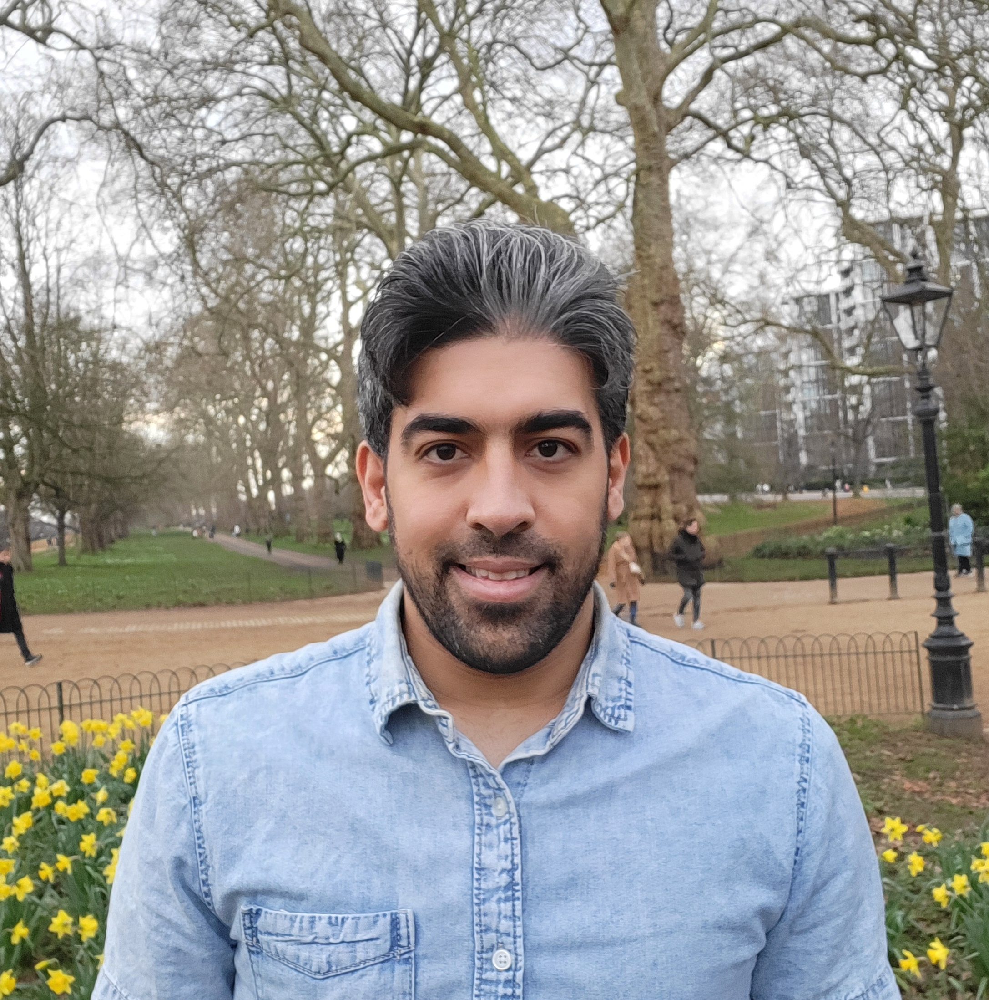

  

I am a senior data scientist at Swiss Data Science Center ([SDSC](https://datascience.ch/)) hub at Paul Scherrer Institute ([PSI](https://www.psi.ch/en/lsm/sdsc-hub-at-psi)). SDSC is a national research infrastructure in data science within ETH Zurich, EPFL, and PSI. My research focuses on machine learning for scientific discovery and healthcare, with particular emphasis on deep learning for computational imaging and inverse problems, generative AI, and foundation models for science and medicine. 

Before joining SDSC, I was a postdoctoral researcher in [Computational X-ray Imaging group](https://www.epfl.ch/labs/cxi/) at PSI and EPFL, working with [Prof. Manuel Guizar Sicairos](https://people.epfl.ch/manuel.guizar?lang=en). I obtained my PhD with [Prof. Ivan Dokmanić](https://sada.dmi.unibas.ch/en/people/head-of-sada/ivan-dokmanic) in Computer Science from the University of Basel. During my PhD, I was awarded a prestigious grant to spend nine months as a visiting researcher at University College London (UCL), where I worked with [Prof. Jason McEwen](http://www.jasonmcewen.org/) on cosmological imaging problems.

 &nbsp;&nbsp;&nbsp;  &nbsp;&nbsp;&nbsp;  &nbsp;&nbsp;&nbsp;  
<!-- &nbsp;&nbsp;&nbsp;  -->

  
<!-- I am seeking a full-time position starting in Fall 2024. Please don't hesitate to reach out if my experience fits for your organization. -->

## News
* **July 2025**: [LoFi](https://ieeexplore.ieee.org/document/11108275) published in IEEE Transactions on Computational Imaging.
* **May 2025**: [GLIMPSE](https://ieeexplore.ieee.org/document/11018464) published in IEEE Transactions on Medical Imaging.
* **November 2024**: Our recent [preprint](https://arxiv.org/abs/2411.04995) is now available on ArXiv.
* **September 2024**: I am thrilled to announce that I have successfully defended my PhD! 🎓 My thesis is now available [here](https://edoc.unibas.ch/96769/).
* **July 2024**: I have been invited by the Signal Processing Society (SPS) to present a [webinar](https://signalprocessingsociety.org/blog/sps-webinar-deep-generative-models-bayesian-imaging) on deep generative models for Bayesian imaging.
* **May 2024**: I give a talk on physics-informed neural networks for cosmological inverse problems at the [Cosmo 21 Conference](https://cosmo21.cosmostat.org/) in Chania, Greece.
* **Jan 2024**: Our recent [preprint](https://arxiv.org/abs/2401.00816) is now available on ArXiv.
* **Nov 2023**: Our [paper](https://ieeexplore.ieee.org/abstract/document/10054422) "Conditional Injective Flows for Bayesian Imaging" is among the top 25 most downloaded papers in IEEE Transactions on Computational Imaging (TCI) from Sept. 2022 - Sept. 2023.
* **Aug 2023**: Our [paper](https://ieeexplore.ieee.org/abstract/document/10250175) "Deep Injective Prior for Inverse Scattering" has been accepted by IEEE Transactions on Antennas and Propagation.
* **July 2023**: I am awarded a grant by the Promotion of Young Talent at the University of Basel to spend 9 months as a visiting scholar at University College London (UCL), focused on leveraging deep generative models for astrophysics in Prof. Jason McEwen's [group](http://www.jasonmcewen.org/). 
* **Feb 2023**: Our [paper](https://ieeexplore.ieee.org/abstract/document/10054422) "Conditional Injective Flows for Bayesian Imaging" has been accepted by IEEE Transactions on Computational Imaging.
* **Jan 2023**: Our [paper](https://openreview.net/forum?id=BT4N_v7CLrk) "FunkNN: Neural Interpolation for Functional Generation" has been accepted by ICLR 2023.
* **Dec 2022**: Our [paper](https://ieeexplore.ieee.org/abstract/document/10133365) has been accepted by European Conference on Antennas and Propagation (EUCAP 2023).
* **Jun 2021**: Our [paper](https://proceedings.mlr.press/v161/kothari21a.html) has been accepted by the Conference on Uncertainty in Artificial Intelligence (UAI 2021).
* **April 2020**: I started my Ph.D. at the [SADA](https://sada.dmi.unibas.ch/en/) group, University of Basel.

  

## Publications

 

  
     

**End-to-end localized deep learning for Cryo-ET**  
Vinith Kishore, Valentin Debarnot, Ricardo D. Righetto, AmirEhsan Khorashadizadeh, Benjamin D. Engel, and
Ivan Dokmanić  
**Under review 2025**    
 &nbsp;&nbsp;&nbsp;
&nbsp;&nbsp;&nbsp; 

   

  
     

**Lofi: Neural local fields for scalable image reconstruction**  
AmirEhsan Khorashadizadeh, Tob ́ıas I. Liaudat, Tianlin Liu, Jason D. McEwen and Ivan Dokmanić  
**IEEE Transactions on Computational 2025**    

&nbsp;&nbsp; 
&nbsp;&nbsp;&nbsp; 

   

  
     

**GLIMPSE: Generalized Locality for Scalable and Robust CT**  
AmirEhsan Khorashadizadeh, Valentin Debarnot, Tianlin Liu and Ivan Dokmanić  
**IEEE Transactions on Medical Imaging 2025**    

&nbsp;&nbsp; 
&nbsp;&nbsp;&nbsp; 

     

  
       

**FunkNN: Neural Interpolation for Functional Generation**  
AmirEhsan Khorashadizadeh, Anadi Chaman, Valentin Debarnot and Ivan Dokmanić  
**ICLR 2023**      
 &nbsp;&nbsp;&nbsp; 
&nbsp;&nbsp;&nbsp; 

   

  

**Deep Injective Prior for Inverse Scattering**  
AmirEhsan Khorashadizadeh, Vahid Khorashadizadeh, Sepehr Eskandari, Guy A.E. Vandenbosch and Ivan Dokmanić  
**IEEE Transactions on Antennas and Propagation 2023**    
 &nbsp;&nbsp;&nbsp; 
&nbsp;&nbsp;&nbsp; 

 

  

**Conditional Injective Flows for Bayesian Imaging**  
AmirEhsan Khorashadizadeh, Konik Kothari, Leonardo Salsi, Ali Aghababaei Harandi, Maarten de Hoop and Ivan Dokmanić  
**IEEE Transactions on Computational Imaging 2023**    
 &nbsp;&nbsp;&nbsp; 
&nbsp;&nbsp;&nbsp; 

 

  

**Deep Variational Inverse Scattering**  
AmirEhsan Khorashadizadeh, Ali Aghababaei, Tin Vlavsić, Hieu Nguyen and Ivan Dokmanić  
**European Conference on Antennas and Propagation (EuCAP) 2023**    
 &nbsp;&nbsp;&nbsp; 
&nbsp;&nbsp;&nbsp; 

 

  
    

**Implicit Neural Representation for Mesh-Free Inverse Obstacle Scattering**  
Tin Vlašić, Hieu Nguyen, AmirEhsan Khorashadizadeh and Ivan Dokmanić  
**Asilomar Conference on Signals, Systems, and Computers 2022**    

    

  
   

**Trumpets: Injective flows for inference and inverse problems**  
Konik Kothari, AmirEhsan Khorashadizadeh, Maarten de Hoop and Ivan Dokmanić  
**UAI 2021**   
 &nbsp;&nbsp;&nbsp; 
&nbsp;&nbsp;&nbsp; 

   

